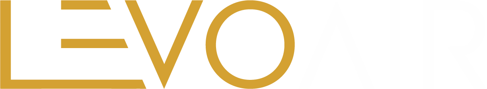
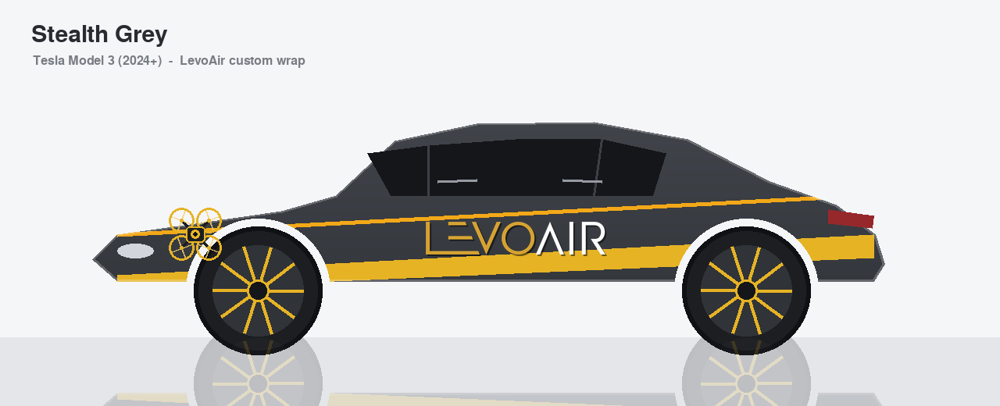
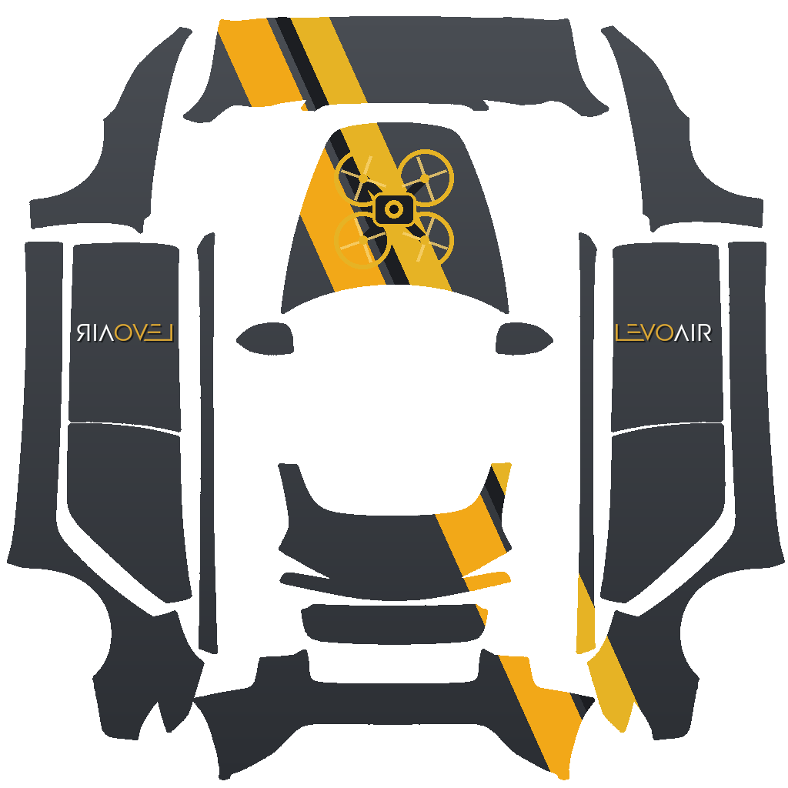
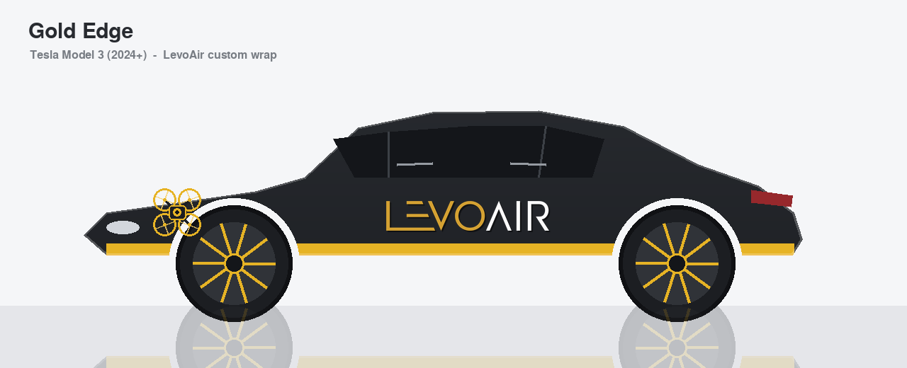
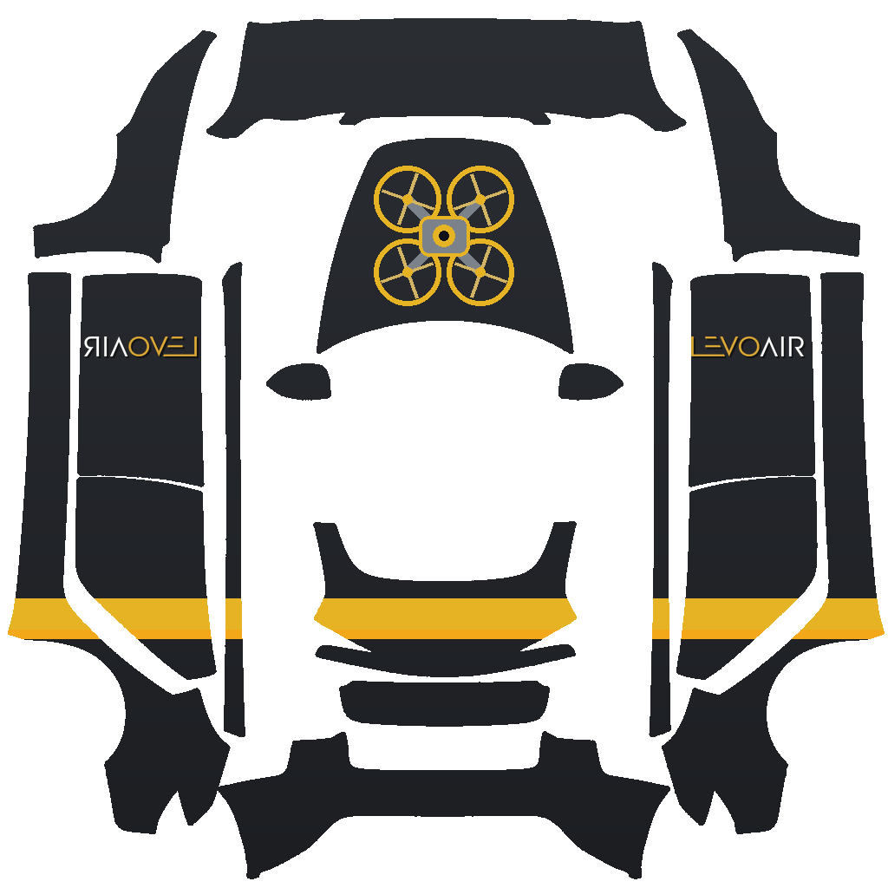
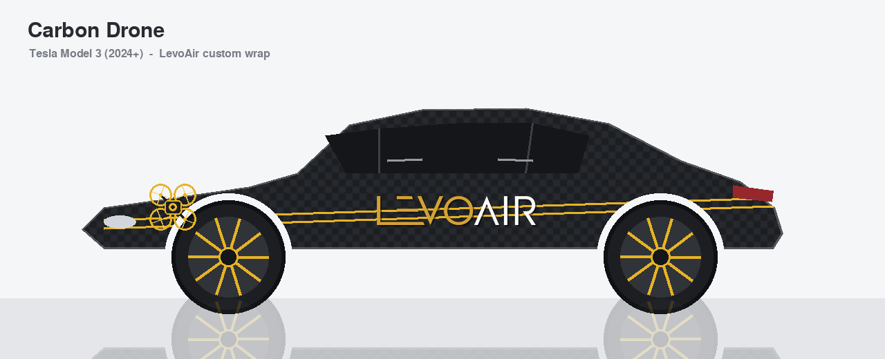
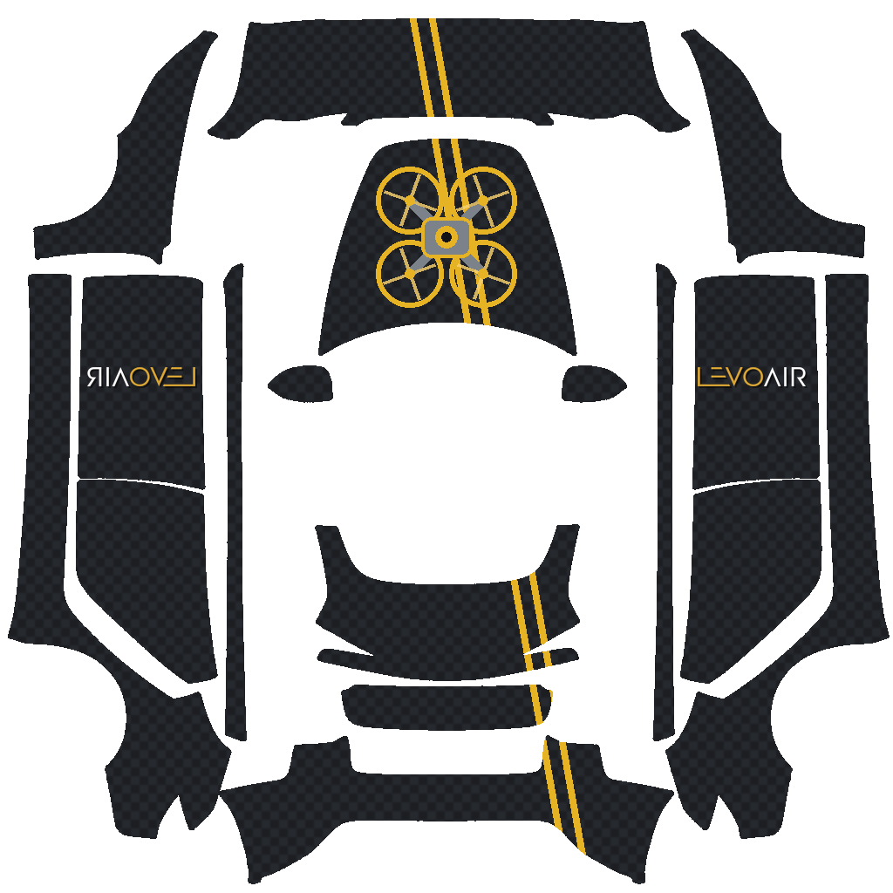
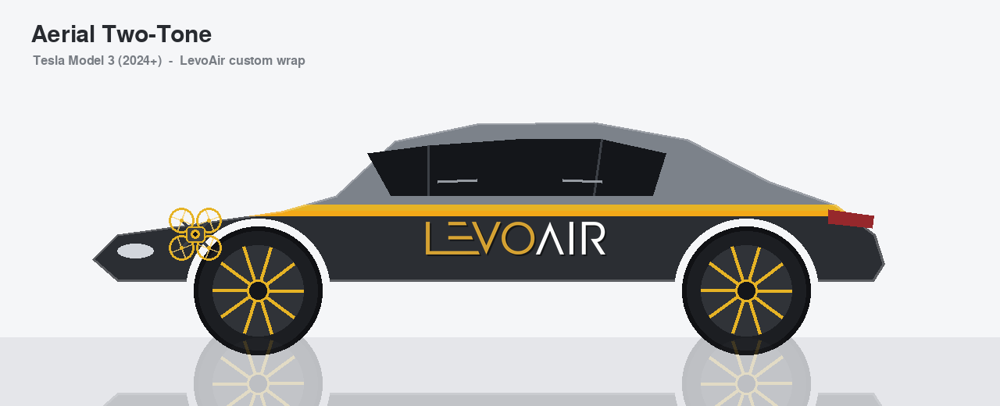
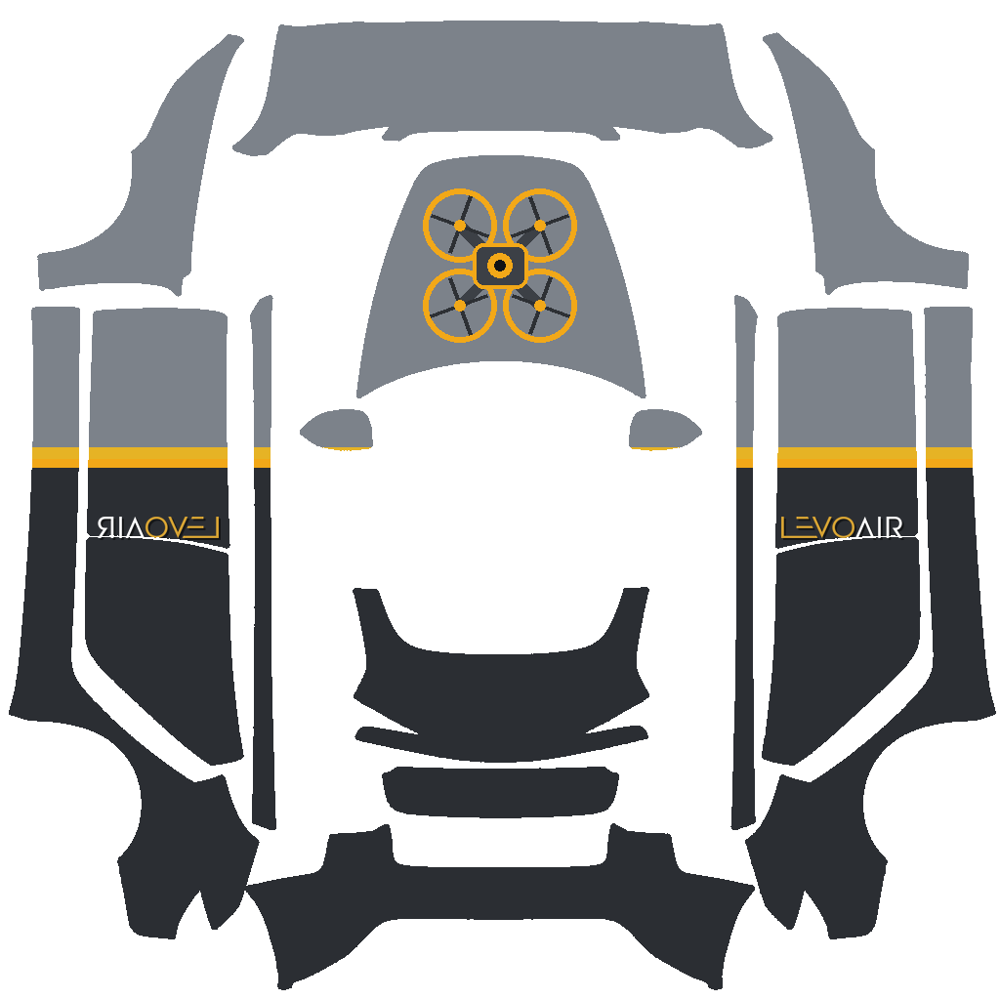

<p align="center">
  
</p>

<h1 align="center">LevoAir Custom Wraps &middot; Tesla Model 3 (2024+)</h1>

<p align="center">
Brand-grey paint with <b>LevoAir gold</b> accents, a drone emblem on the hood and the
official <b>LevoAir</b> wordmark on the doors. Four designs for the
<a href="../model3-2024-base/">Model 3 (2024+) base</a> Paint Shop wrap template.
</p>

<p align="center">
  <b>Brand palette:</b>
  Gold <code>#E6B325</code> &nbsp;&middot;&nbsp; Accent gold <code>#F2A818</code>
  &nbsp;&middot;&nbsp; Stealth grey &amp; charcoal base
</p>

---

## Designs &mdash; previewed on a car

### Stealth Grey
Gunmetal grey gradient with a bold gold diagonal swoosh, gold drone on the hood, LevoAir wordmark on both doors.

<a href="../model3-2024-base/example/LevoAir_Stealth_Grey.png"></a>
<a href="../model3-2024-base/example/LevoAir_Stealth_Grey.png"></a>

[Download wrap file](../model3-2024-base/example/LevoAir_Stealth_Grey.png)

### Gold Edge
Deep charcoal with a clean gold rocker stripe along the lower body, hood drone and door wordmarks.

<a href="../model3-2024-base/example/LevoAir_Gold_Edge.png"></a>
<a href="../model3-2024-base/example/LevoAir_Gold_Edge.png"></a>

[Download wrap file](../model3-2024-base/example/LevoAir_Gold_Edge.png)

### Carbon Drone
Woven carbon-grey with twin gold pinstripes and an oversized gold drone hero on the hood.

<a href="../model3-2024-base/example/LevoAir_Carbon_Drone.png"></a>
<a href="../model3-2024-base/example/LevoAir_Carbon_Drone.png"></a>

[Download wrap file](../model3-2024-base/example/LevoAir_Carbon_Drone.png)

### Aerial Two-Tone
Light-grey upper split from a charcoal lower by a gold beltline. Understated and premium.

<a href="../model3-2024-base/example/LevoAir_Aerial_TwoTone.png"></a>
<a href="../model3-2024-base/example/LevoAir_Aerial_TwoTone.png"></a>

[Download wrap file](../model3-2024-base/example/LevoAir_Aerial_TwoTone.png)

---

## Interactive gallery (GitHub Pages)

An interactive site lives in [`index.html`](index.html). To publish it:
**repo Settings &rarr; Pages &rarr; Build from branch**, pick the branch and root folder.
It will then be served at:

```
https://mncoleman.github.io/custom-wraps/levoair/
```

## Apply on your Tesla

1. Download a wrap `.png` above.
2. Format a USB drive (exFAT / FAT32) and create a `Wraps` folder at the root.
3. Copy the PNG(s) in (up to 10, each &le; 1&nbsp;MB).
4. In the car: **Toybox &rarr; Paint Shop &rarr; Wraps** &rarr; pick your LevoAir design.

---

## Notes & assets

* The **LevoAir wordmark** is the official brand logo (`brand/levoair_logo.png`),
  pulled from the LevoAir site CDN. On the doors it is mirrored on the driver side in
  the texture so it reads correctly on the physical car.
* The LevoAir repo ships **no drone image file** (the site uses Lucide vector icons such
  as `Plane`), so the hood drone is a custom gold quadcopter emblem drawn in the brand
  gold. Swap in a specific drone asset any time and re-run the generator.
* **Reproduce / tweak:** `python3 generate.py` (wrap textures) and `python3 mockup.py`
  (car previews), run from the repo root.
* Mockups are stylised side-profile previews; the real on-car finish is rendered by the
  vehicle's 3D Paint Shop from the wrap PNG.
